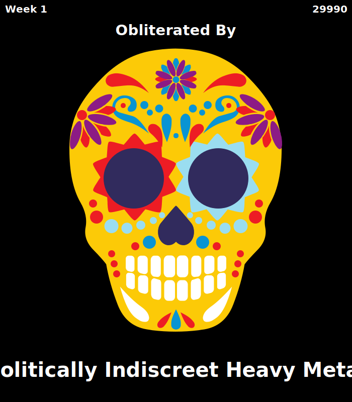

# Doom Cult Society

**Doom Cult Society is a collectible cultish cult simulator for Ethereum**

**No fees, only gas. Doom Cult Society is for everyone!**

> 1. Attract cultists
> 2. Sacrifice cultists to placate the wrath of the Doom Cult Society DAO
> 3. Survive for as long as possible

Wnat to know more? Doom Cult Society has two phases:

***

# Phase 1: Prognostication

30,000 cultists are searching for an aspiring demagogue to lead them into this brave new world. Rally cultists to your side quickly before its too late!

**Phase 1 Ends When**: All cultists have been acquired OR 4 weeks pass.

# Phase 2: Countdown To Oblivion

The goal is to survive for as long as possible.  
Each week the faithful must **sacrifice** some cultists to The DAO.  
Each sacrifice generates an NFT to commemorate this act of selflessness.

**To placate The DAO, each week's sacrifice must be greater than the last. If this condition is not met, the Doom Cult Society DAO is DESTROYED.**

One the DAO is destroyed, it's game over. Previously minted NFTs will persist but all your living cultists go up in smoke.

The community can keep the Doom Cult Society alive for **52** weeks, but no longer.  
It is a doom cult after all.

Minting a Doom Cult Society NFT on week 52 can be considered the game's 'win condition' ...whatever that means.

***

# How To Play

The Doom Cult Society is designed to be played using the Doom Cult Society DAO contract interface in Etherscan.

* **Doom Cult Society DAO Contract** (attract/sacrifice cultists): `0xfff`  
* **Doom Cult Society NFT Contract** (view/trade/lovingly embrace dead cultist NFTs): `0xfff`

**Attract Cultists**: `attractCultists()` : will give the user 3 CUL tokens until all 30,000 CUL have been distributed  

**Sacrifice Cultists**: `sacrificeCultist()` : will destroy 1 CUL and mint a Doom Cult Society NFT in exchange  

**Worship the DAO**: `worship()` : if 1 week has passed since the last `worship()`, the `doomCounter` is advanced 1 week. If `doomCounter > 52`, the DAO is **obliterated**. If the current week's total sacrificed is less than the previous week, the DAO is **obliterated**  

**Game Stats**:

* `lastEpochTotalSacrificed()` : How many sacrificed last week?
* `currentEpochTotalSacrificed()` : How many sacrifices so far this week?
* `timestampUntilNextEpoch()` : Timestamp after which the DAO can be `worship()`ped, and the faithful tested...

# View NFTs

The Doom Cult Society NFTs have their image data directly embedded into their tokenURI.  

To view a token's image directly call `DoomCultSociety.imageURI(tokenId)` on Etherscan and paste the output string into your browser!  

### N.B. Etherscan really wasn't designed for this sort of thing. Sometimes a comma can go missing when trying to access the nft image. See below for expert analysis

***

Doom Cult Society is open source software licensed under the Apache-2.0 license. Please feel free to contribute, share, fork, vampire, heckle etc.

***

# FAQ

### Sooo... is this an NFT?

Sort of. Cultists (CUL) are tokens, not NFTs. Once Phase 2 begins you can sacrifice a CUL token to mint an NFT

### How are Doom Cult Society NFTs created?

The Doom Cult NFT contract autogenerates a .svg image based off of:

1. How many weeks in did you sacrifice your cultist
2. How many living cultists are still remaining

In addition, each token describes the highly plausible manner in which your cultist shuffled off this mortal coil. As such, a flip-book of these NFTs can be considered an HR-compliant safety manual on how to stay alive in these trying times.

### What are the pros and cons of the Doom Cult Society?

**Pros**
1. Meet like-minded individuals and trade tips on how to survive the comping apocalypse.
2. CUL tokens are backed by divine economics: religious fervor drives community engagement!

**Cons**
1. Slight risk of being sucked into an apocalyptic death cult

### How do I get CUL tokens?

Call the `attractCultists` method on the Doom Cult Society DAO contract. This will give you 3 CUL.

### `attractCultists` doesn't work!

All 30,000 CUL have been distributed and I am afraid you are too late. I would suggest posting low-effort memes on Twitter until somebody tips you in CUL.

### Should I invest in CUL?

Due to the completely backwards economics of the Doom Cult Society, there is an overwhelming likelihood that the DAO contract will be destroyed shortly after the game starts.  
This destroys all CUL tokens.  
Even if the community somehow manages to keep the DAO going, the contract autodestructs after 52 weeks.  

(Not investment advice. If you're taking advice from text written by a stranger and posted to a webpage literally titled "Doom Cult Society", you should probably put down the blockchain and go outside for a bit...)

### Is there a Discord?

There is no Discord, Slack, Whatsapp, Twitter or Tinder. Only Github.

### Is Doom Cult Society audited?

It's not that kind of crypto project . More of a "threw together over a weekend" kind of deal. Use at your own risk.
